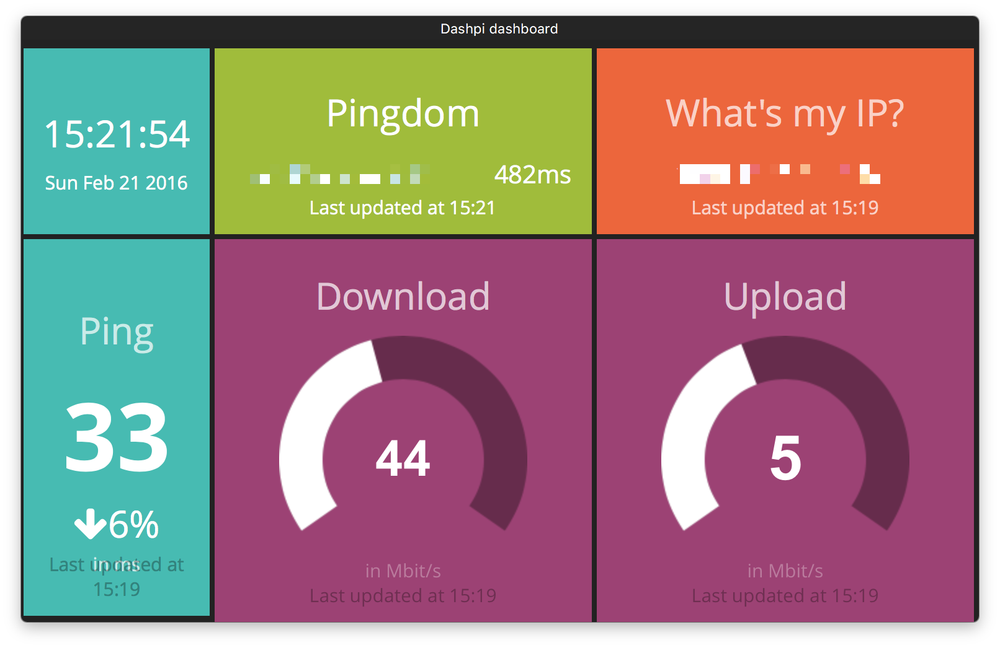

# dashpi

Dashing dashboard w/ clock, Pingdom.com and speedtest.net (IP, Ping, Up-/ Download) widgets.



The dashboard is intended for deployment w/ Docker (leveraging [rpi-dashing](https://github.com/openwebcraft/rpi-dashing)) on a Raspberry Pi 1 Model A+ ARM hardware and for rendering the dashboard on the 7″ Touchscreen Monitor for Raspberry Pi.

Prerequisites on Raspberry Pi:

- Docker, e.g. [Hypriot Docker Image or Debian Packages for Raspberry Pi](http://blog.hypriot.com/downloads/)
- Credentials for [Pingdom](https://www.pingdom.com/). 

Run the image from the public, pre-build image on Docker Hub [matthiasg/rpi-dashpi](https://hub.docker.com/r/matthiasg/rpi-dashpi/):

```
$ docker run -d --restart=always -p 3030:3030 \
	-e DASHING_AUTH_TOKEN=[YOUR_DASHING_AUTH_TOKEN] \
	-e PINGDOM_API_KEY=[YOUR_PINGDOM_API_KEY] \
	-e PINGDOM_USER=[YOUR_PINGDOM_USER] \
	-e PINGDOM_PASSWORD=[YOUR_PINGDOM_PASSWORD]
    matthiasg/rpi-dashpi
```
