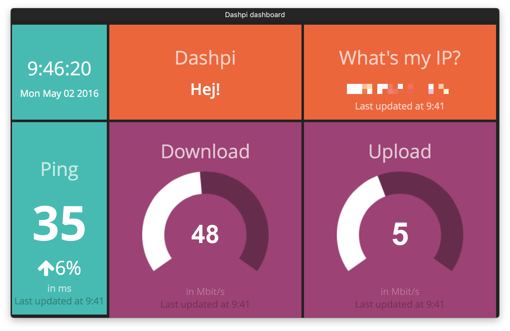

# dashpi

Dashing dashboard w/ clock, UptimeRobot.com and speedtest.net (IP, Ping, Up-/ Download) widgets.

**Screen shot of 1th page**



**Screen shot of 2nd page**


The dashboard is intended for deployment w/ Docker (leveraging [rpi-dashing](https://github.com/openwebcraft/rpi-dashing)) on a Raspberry Pi 1 Model A+ ARM hardware and for rendering the dashboard on the 7″ Touchscreen Monitor for Raspberry Pi.

Prerequisites on Raspberry Pi:

- Docker, e.g. [Hypriot Docker Image or Debian Packages for Raspberry Pi](http://blog.hypriot.com/downloads/)
- Api Key for [Uptime Robot](https://uptimerobot.com/).

Run the image from the public, pre-build image on Docker Hub [matthiasg/rpi-dashpi](https://hub.docker.com/r/matthiasg/rpi-dashpi/):

```
$ docker run -d --restart=always -p 3030:3030 \
	-e DASHING_AUTH_TOKEN=[YOUR_DASHING_AUTH_TOKEN] \
	-e UPTIMEROBOT_APIKEY=[YOUR_UPTIMEROBOT_API_KEY] \
    matthiasg/rpi-dashpi
```
